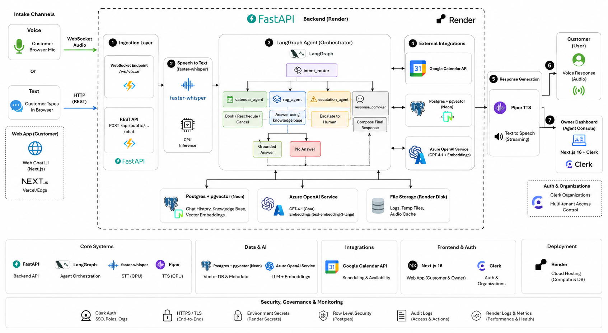

# Voxa

An AI voice receptionist for small businesses. It answers the phone, books
appointments into a real calendar, answers questions from the business's own
documents, and hands over to a human when it shouldn't be answering.

---

## The problem

A dental practice with two staff loses a patient every time the phone rings
during a procedure. A salon owner mid-colour can't stop to take a booking. The
existing options are a receptionist they can't afford, an answering machine
nobody calls back, or a chatbot that confidently invents prices.

The hard part isn't speech. It's the three things a real receptionist does that
a language model does badly on its own:

1. **Booking against reality.** A calendar has actual busy time and the business
   has actual opening hours. An assistant that books over either is worse than
   useless.
2. **Answering from the business's own facts.** "How much is a filling?" has one
   correct answer, and it's in the practice's price list — not in the model's
   weights.
3. **Knowing when to stop.** Complaints, refunds and anything not covered should
   be escalated with a transcript, not improvised.

Voxa is built around those three, and the architecture is mostly a set of
guardrails that make each one hold.

## What it does

- Full voice conversation in the browser: speech in, speech out, over a
  websocket, with barge-in (talking over the reply stops it).
- Multi-turn booking: collects the missing details across turns, checks
  availability, then writes to Google Calendar and the database.
- Retrieval-augmented answers from uploaded PDFs / text, strictly scoped to one
  business.
- Explicit escalation: anything unanswerable becomes a follow-up task with the
  customer's details and the full transcript.
- Owner dashboard: live conversation feed with the routed intent per turn,
  bookings, follow-ups, knowledge base, opening hours and services.
- Email confirmation on booking.

## Architecture



**Stack:** FastAPI · LangGraph · Azure OpenAI (GPT-4.1 + embeddings) ·
Postgres/pgvector (Neon) · faster-whisper · Piper · Next.js 16 · Clerk
Organizations · Google Calendar API · Render.

## Why it's built this way

**An explicit router, not one agent with tools.** A single agent with a
`book_appointment` tool will occasionally answer a pricing question by making
one up, because nothing forces it down a particular path. Here the router
commits to an intent first, and each branch has different rules: the calendar
branch can only write after an availability check, and the RAG branch can only
answer from retrieved text. The chosen intent is stored per message and shown
in the dashboard, so a wrong route is visible rather than mysterious.

**Tenancy lives in one dependency.** `get_current_business` derives the
business from the Clerk session's `org_id` claim. No endpoint accepts a business
id from an authenticated client, so there is no "forgot to check the owner"
class of bug. `document_chunks` denormalises `business_id` specifically so
vector search filters on an indexed column of the same table — the tenant filter
can't be accidentally dropped by a join.

**Availability is re-checked inside the write path.** Checking availability and
then booking is two operations; between them the calendar can change. Every
create/reschedule re-runs the check immediately before writing, and the database
has a `CHECK (ends_at > starts_at)` constraint underneath.

**Retrieval has a floor, and a way to say no.** Chunks below a cosine-distance
threshold are discarded, and the answering prompt must emit a sentinel when the
excerpts don't contain the answer. That sentinel routes to escalation. This is
why the salon can't answer a question about the dental practice's prices even
though both live in the same table — and there's a test that proves it, using a
*closer* vector from the wrong tenant.

**Conversation state is a column, not a checkpointer.** The half-filled booking
lives in `conversations.booking_draft`. It survives a restart and works across
instances, which an in-memory LangGraph checkpointer does not.

**Voice is turn-based, honestly.** The browser detects silence and marks the end
of a turn; the server transcribes, thinks, and streams synthesised audio back
sentence by sentence. CPU Whisper can't do true streaming transcription on a
free instance, and faking it would add latency without adding interactivity.
Barge-in is real: incoming audio cancels playback mid-sentence.

## Running it locally

Requires Python 3.12+, Node 20+, and a Postgres with pgvector (a free
[Neon](https://neon.tech) project is the quickest route; `docker compose up db`
also works if you have Docker).

```bash
cp .env.example .env      # then fill it in — see the table below
```

**API**

```bash
cd apps/api
python -m venv .venv && .venv/Scripts/activate     # source .venv/bin/activate on macOS/Linux
pip install -r requirements.txt -r requirements-voice.txt -r requirements-dev.txt
alembic upgrade head
python -m scripts.seed_demo                        # two demo businesses
uvicorn app.main:app --reload
```

**Web**

```bash
cd apps/web
npm install
npm run dev
```

Open <http://localhost:3000>. The seed script prints a business id — open
`/demo/<that-id>` to talk to the receptionist without signing in.

To exercise the graph without a browser:

```bash
cd apps/api
python -m scripts.chat_repl <business-id> --script book
python -m scripts.chat_repl <business-id> --script question
python -m scripts.chat_repl <business-id> --script escalate
```

### Configuration

| Variable | Needed for | Notes |
| --- | --- | --- |
| `DATABASE_URL` | everything | Neon or local Postgres **with the `vector` extension** |
| `AZURE_OPENAI_*` | everything | chat + embedding deployment names |
| `EMBEDDING_DIMENSIONS` | RAG | must match the deployment (1536 for `text-embedding-3-small`) |
| `CLERK_SECRET_KEY`, `CLERK_ISSUER`, `NEXT_PUBLIC_CLERK_PUBLISHABLE_KEY` | dashboard | Organizations must be enabled |
| `CLERK_WEBHOOK_SECRET` | org sync | optional; keeps business names in step |
| `GOOGLE_CLIENT_ID/SECRET/REDIRECT_URI` | real calendar | optional — without it, availability falls back to Voxa's own bookings |
| `TOKEN_ENCRYPTION_KEY` | Google | Fernet key; refresh tokens are encrypted at rest |
| `SMTP_*` | confirmations | a Gmail app password works |
| `WHISPER_MODEL` | voice | `base.en` locally, `tiny.en` on a 512MB instance |

The API starts and serves text mode without the voice, Google or SMTP settings.
`GET /health` reports exactly which integrations are configured.

Leave optional keys **empty** rather than as placeholder strings — the code
treats empty as "not configured" and degrades cleanly, whereas a fake
`whsec_...` reaches Svix and fails signature verification with a misleading 401.

### Where each credential comes from

**Neon** (`DATABASE_URL`) — create a free project at
[neon.tech](https://neon.tech), then copy the **pooled** connection string from
*Connection Details*. Paste it exactly as Neon gives it; `app/config.py`
rewrites the scheme to `postgresql+asyncpg://` and strips the libpq-only
`sslmode` / `channel_binding` parameters that asyncpg rejects. TLS is still
applied — `app/db.py` enables it for any non-localhost host. The `vector`
extension is created by the first migration.

**Clerk** (`CLERK_*`, `NEXT_PUBLIC_CLERK_PUBLISHABLE_KEY`) — create an
application, then **Configure → Organizations → Enable**; without this there is
no `org_id` claim and every authenticated request is rejected by design.
*API Keys* gives the publishable and secret keys. `CLERK_ISSUER` is the
**Frontend API URL** (`https://<slug>.clerk.accounts.dev`, no trailing slash) —
`app/deps.py` appends `/.well-known/jwks.json` to it and also checks it as the
`iss` claim, so it must match exactly. `CLERK_WEBHOOK_SECRET` is only needed if
you expose a public webhook endpoint; leave it empty locally.

**Google Calendar** (`GOOGLE_CLIENT_ID/SECRET`) — in Google Cloud Console:
enable the **Google Calendar API**, configure the OAuth consent screen as
*External*, add the `calendar.events` and `calendar.readonly` scopes, add
yourself as a **test user**, then create an *OAuth client ID → Web application*
whose authorised redirect URI is exactly `GOOGLE_REDIRECT_URI`. Note that while
the consent screen is in *Testing*, Google expires refresh tokens after seven
days, so a long-lived demo needs the app published.

**Gmail SMTP** (`SMTP_*`) — requires 2-Step Verification, then an
[App Password](https://myaccount.google.com/apppasswords); your normal password
will not authenticate.

**`TOKEN_ENCRYPTION_KEY`** — generate with
`python -c "from cryptography.fernet import Fernet; print(Fernet.generate_key().decode())"`.

## Tests

```bash
cd apps/api
pytest -q            # tenant isolation needs DATABASE_URL; the rest run offline
ruff check app tests alembic scripts
```

The suite deliberately concentrates on the claims that would be embarrassing to
get wrong: cross-tenant reads, opening-hours and overlap boundaries, the
router's fallback behaviour, and speech normalisation.

## Deployment

`render.yaml` deploys both services to Render's free tier against a Neon
database. After the first deploy, update `GOOGLE_REDIRECT_URI` and Clerk's
allowed origins to the Render URLs. Free instances spin down when idle, so the
first request after a pause is slow — and the first voice turn additionally
downloads the Whisper and Piper models.

## Trade-offs and limits

- **Turn-based, not full duplex.** See above.
- **Documents are indexed synchronously** during upload. Fine for a price list;
  a 200-page manual would want a queue.
- **One opening-hours window per day.** No split shifts or holiday overrides.
- **Escalation is email + a dashboard task**, not a live transfer.
- **Free-tier substitutions.** Deepgram → faster-whisper, ElevenLabs → Piper,
  Twilio SMS → SMTP email, managed Postgres → Neon. Each is a real, working
  implementation, not a stub, but the hosted equivalents are faster.

## Next

An embeddable `<script>` widget so a business can drop Voxa onto its own site;
streaming partial transcripts once a GPU is available; SMS confirmations;
per-business analytics on deflection rate; multi-language via Whisper's
multilingual models and per-locale Piper voices.

## Licence note

Text-to-speech uses [Piper](https://github.com/OHF-Voice/piper1-gpl), which is
**GPL-3.0-or-later**. It is invoked as a library in this repository, so
redistributing Voxa as a whole carries GPL obligations. Swapping `app/services/tts.py`
for a hosted TTS provider removes that dependency.
